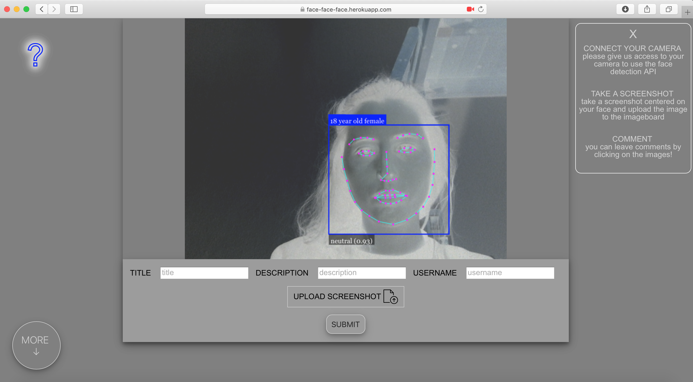
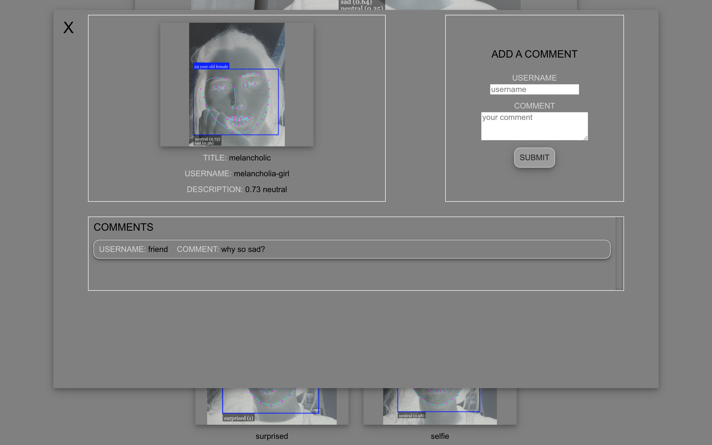

# Face Recognition web app

Face Recognition web app where users can upload images and leave comments.

Users' webcams are connected to the site and their faces are automatically detected by the API.
The API indicates users' age, gender, and emotion. 

Users can take screenshots and upload images to the site.

The images that have been uploaded are displayed on scroll below the cam section. 

A modal box where users can leave comments appears by clicking on each image. Each image has a specific url that users can send for reference.

[visit live app](https://face-face-face.herokuapp.com/)

## Features

- face-detection API on users' webcams
- browse image gallery
- comment on images
- uploading of images

## Tech

**Stack**: Node.js, Express, PostgreSQL, Vue.js <br />
**Storage**: Cloudinary </br>
**Deployment**: Heroku

## Installation

Once you have cloned or downloaded the repository code:

```
cd Face-Recognition-app
npm install
```

Set up a PostgreSQL database (download [PostgreSQL](https://www.postgresql.org/download/) if necessary) and add the database credentials in an .env file (make sure this file is ignored by git).

Next, create a free [Cloudinary](https://cloudinary.com/) account and add the credentials in the 
.env file. The cloud storage account is needed to store the uploaded images; there are many providers (such as AWS ect.); I am using Cloudinary in this project.

Run your app's local server:

```
npm start
```


## Screenshots



