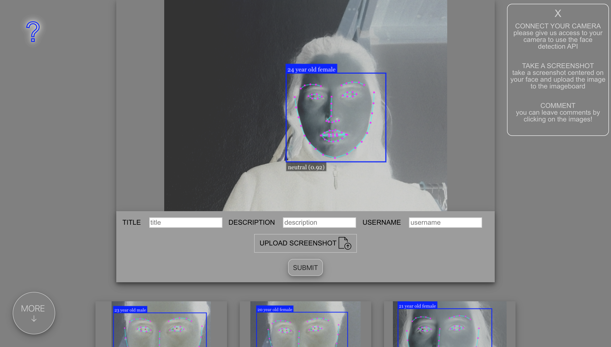
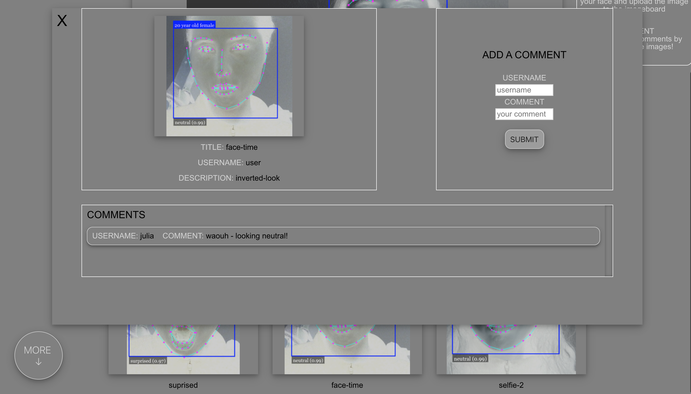

# Face-dectection, selfie imageboard made with Vue.js

Vue.js app using the face recognition API [face-api.js](https://github.com/justadudewhohacks/face-api.js).   

Users' webcams are connected to the site and their faces are automatically detected by the API.
The API visually indicates its assumptions on their age, gender, and emotion. Once their faces
have been detected, users take a screenshot and upload the image to the site.    

All the images that have been uploaded are displayed on scroll below the cam section. A modal box appears by clicking on each image and users can leave comments. Each image also has a specific url that users can send for reference.  
I've automated a regular clean-up of the images in the database with Node Cron.
  
Technologies: HTML, CSS, JavaScript, Node with Express.js, PostgreSQL  
Library: Vue.js | API: face-api.js | Storage: Cloudinary
