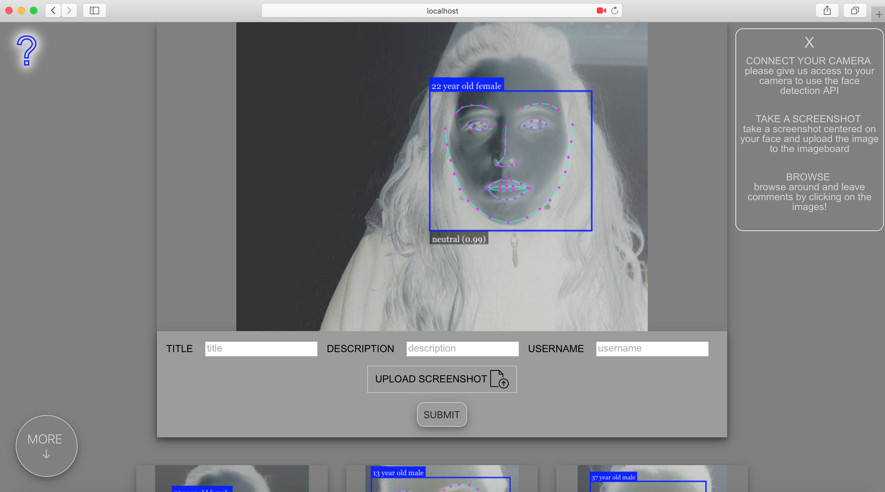
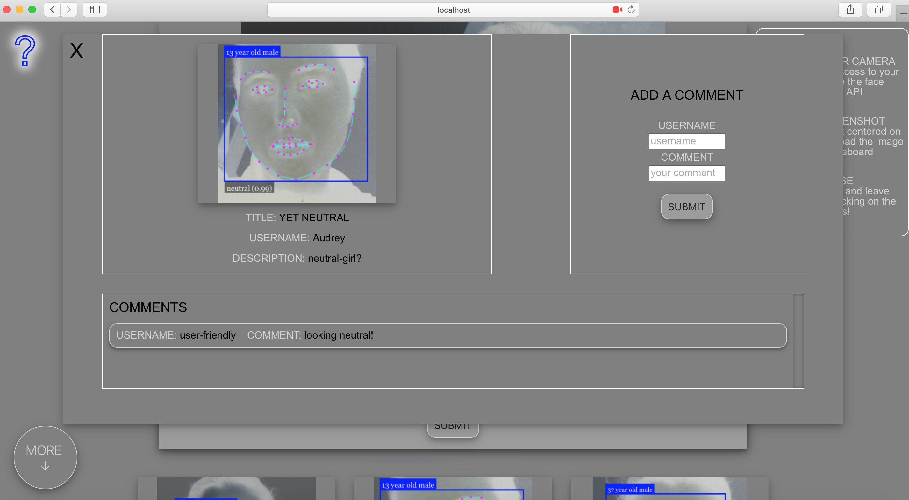

# selfie-imageboard

This site was developed as an experimental selfie imageboard. Inspired by Instagram, it was developed
with Vue.js and uses the JavaScript face recognition API [face-api.js](https://github.com/justadudewhohacks/face-api.js).   

Users' webcams are connected to the site and their faces are automatically detected by the API.
The API visually indicates its assumptions on their age, gender, and emotion. Once their faces
have been detected, users take a screenshot and upload the image to the site.    

All the images that have been uploaded are displayed on scroll below the cam section. A modal box appears by clicking on each image where users can leave comments. Each image also has a specific url that users can send for reference.  
Technologies: HTML, CSS, JavaScript, Node with Express.js, PostgreSQL  
Library: Vue.js | API: face-api.js | Storage: AWS
