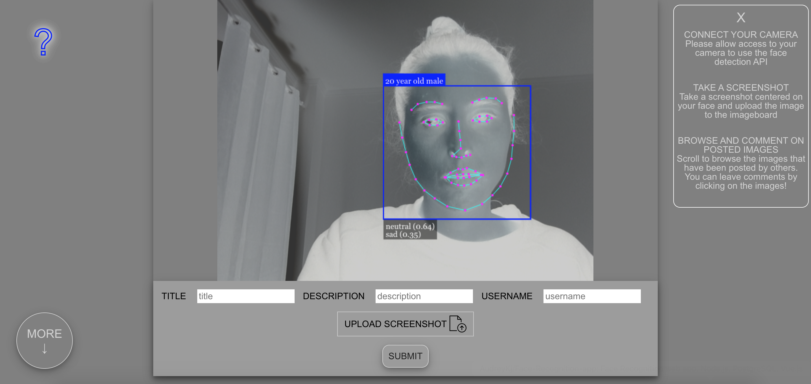

# Face Recognition web app

Face Recognition web app where users can upload images and leave comments.

Users' webcams are connected to the site and their faces are automatically detected by the API.
The API indicates users' age, gender, and emotion. Users can take screenshots and upload images to the site.

The images that have been uploaded are displayed on scroll below the cam section. A modal box where users can leave comments appears by clicking on each image. Each image also has a specific url that users can send for reference.

[visit live app](https://face-face-face.herokuapp.com/)

## Features

- face-detection API on users' webcams
- browse image gallery
- comment on images
- uploading of images

## Tech

**Stack**: Node.js, Express, PostgreSQL, Vue.js  
**Storage**: Cloudinary  
**Deployment**: Heroku

## Screenshots

